# ClearChain - An Anti-Corruption System


<!-- Add your banner image below if desired -->


A blockchain-powered platform to automate vulnerable processes and combat corruption through transparent governance.

## 🚀 Key Features

- **Blockchain-based Tenders and Reports:**  
  Automated, immutable recording of tenders and reports on the Ethereum blockchain.
- **Anonymous Reporting Systems:**  
  Secure whistleblowing system to anonymously report corruption incidents.
- **Admin Dashboard (Verified Official):**  
  A comprehensive web dashboard for government officials to verify, process, and audit submissions.
- **Chat Bot Integration ("DEX"):**  
  An integrated chatbot, DEX, to assist users with queries and guide them through reporting processes.

## 📸 Screenshots

### Web Dashboard Screenshots
https://clear-chain.vercel.app/
1. 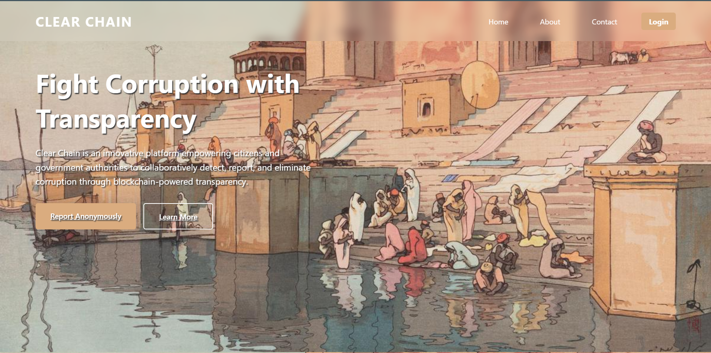
2. 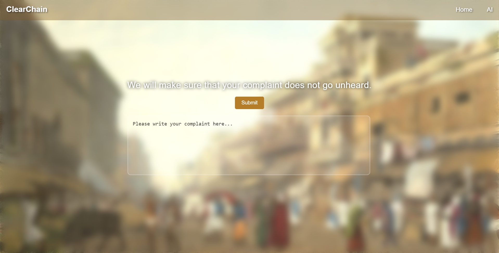
3. 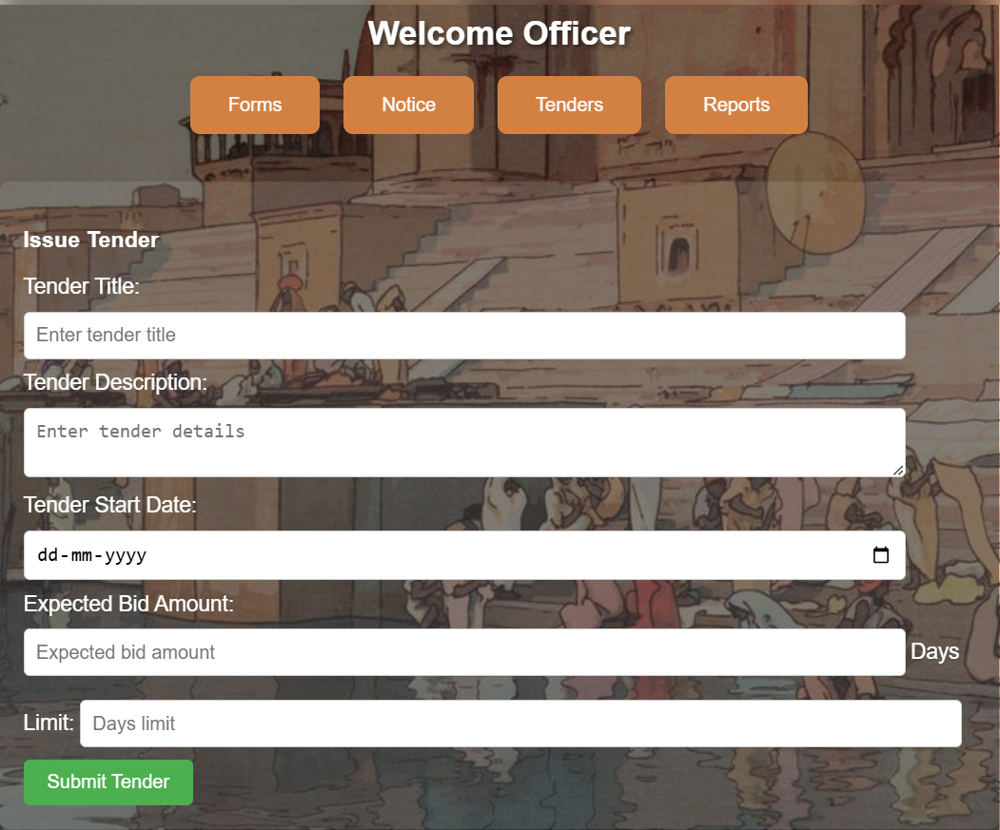
4. 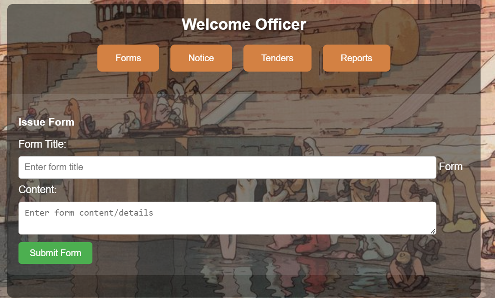
5. 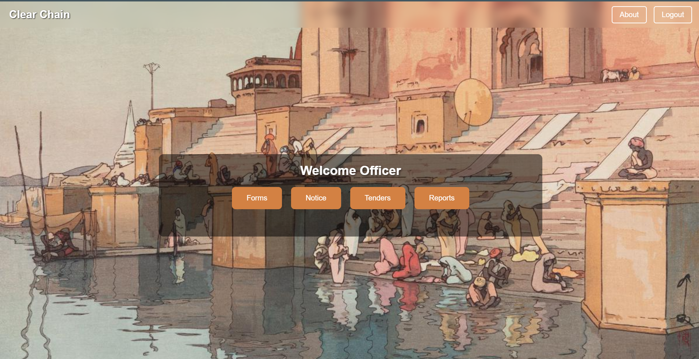
6. 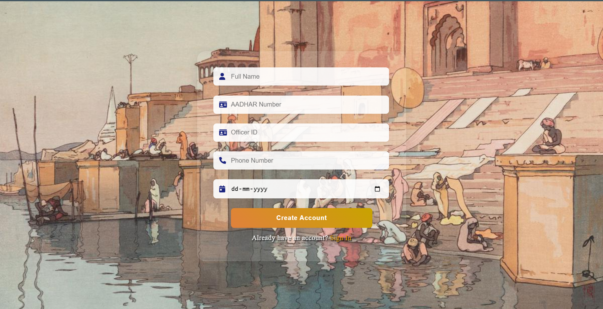
7. 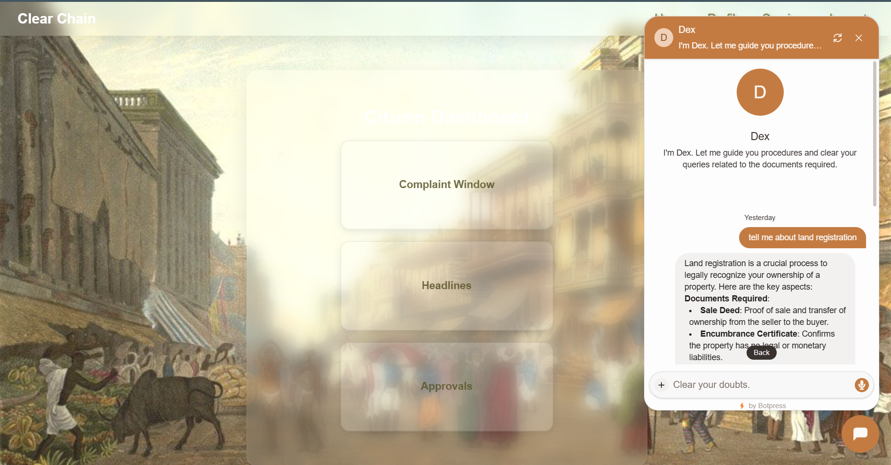
8. 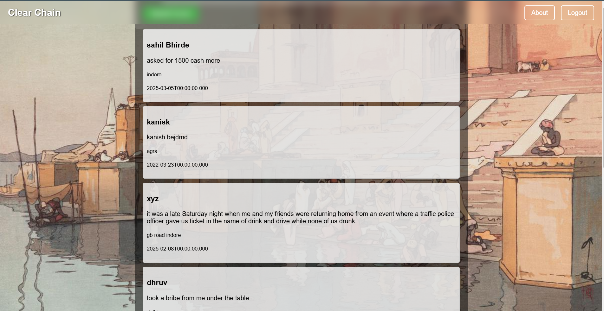
9. 

### Mobile App Screenshots

#### Reporting using App
- 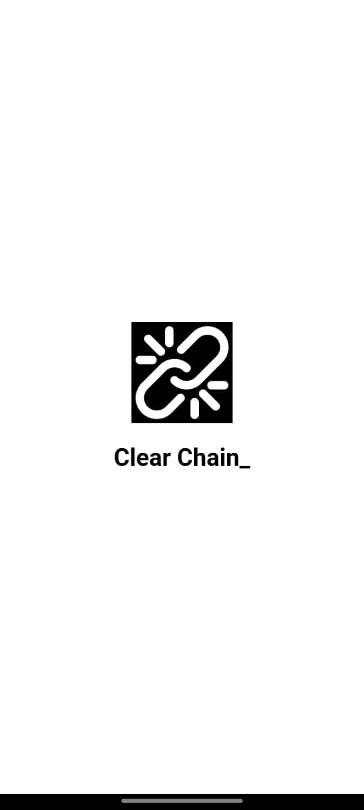
- 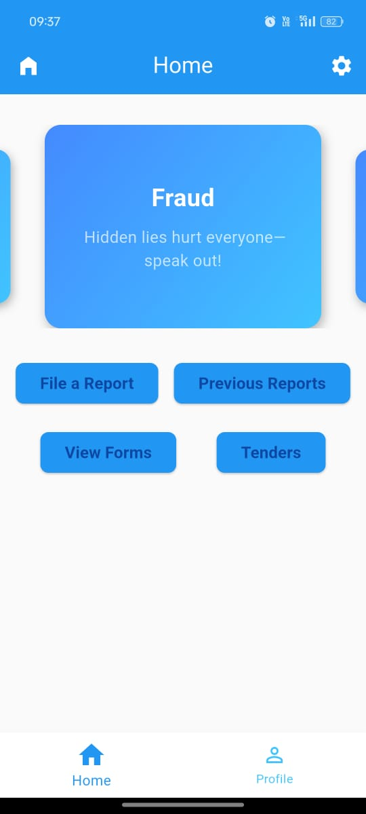
- 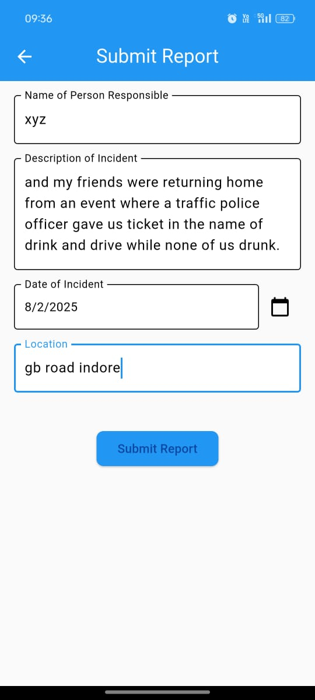


## ⚙️ Tech Stack

**Frontend**  
- Flutter (Mobile App)
- HTML / CSS / JS (Web Dashboard)

**Backend**  
- Node.js + Express.js
- Solidity Smart Contracts
- Ethereum Blockchain
- Firebase Storage

## 📲 Installation

### Mobile App
```bash
# Clone repository
git clone https://github.com/mudiverse/ClearChain.git

# Install dependencies
flutter pub get

# Run application
flutter run
